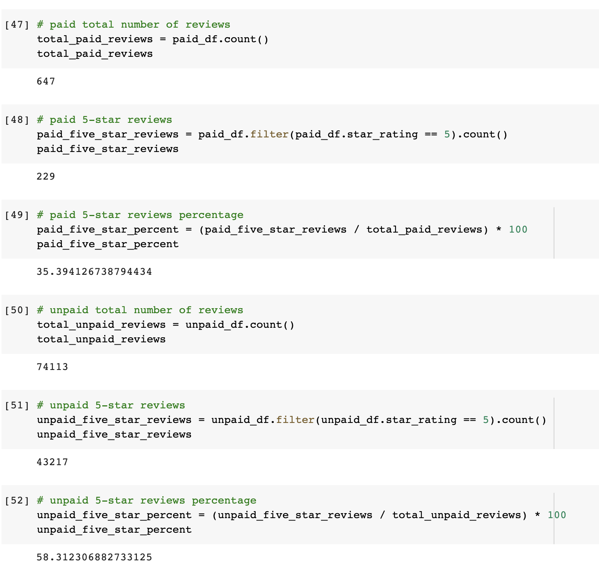
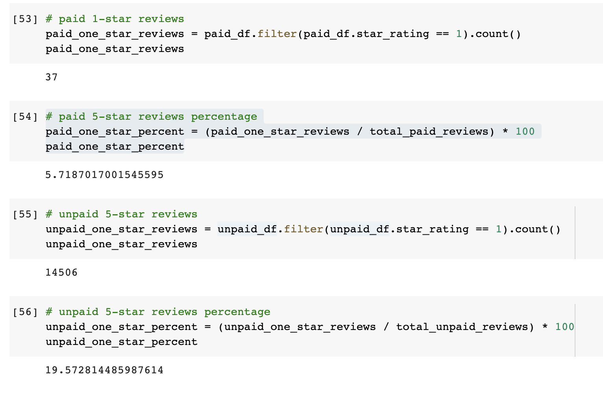

# Amazon_Vine_Analysis

## Overview of the analysis: 

This analysis uses data from Amazon reviews written by paid members of the Amazon Vine program. The Amazon Vine program is a service that allows manufacturers and publishers to receive reviews for their products. Companies pay a small fee to Amazon and provide products to Amazon Vine members, who are then required to publish a review.  By comparing the ratings from the (paid) Vine members vs (unpaid) non-Vine members, we can gain insight to any bias to positive reviews from the Vine members.

Resources: [Amazon Vine reviews](https://s3.amazonaws.com/amazon-reviews-pds/tsv/index.txt), [Beauty product reviews](https://s3.amazonaws.com/amazon-reviews-pds/tsv/amazon_reviews_us_Beauty_v1_00.tsv.gz)

## Results: 

From the above results using PySpark:

--There's a total of 647 Vine reviews and 74,113 non-Vine reviews

--Out of all the 5 stars reviews, there were 229 Vine reviews and 43,217 non-Vine reviews.

--About 35% Vine reviews and 58% of non-Vine reviews were 5 stars

## Summary: 

Although the Vine members were paid reviewers of the products, the reviews did not show positivity bias in the results from the analsysis.  The percentage of 5 stars reviews by the paid Vine members were low in percentage (35%), less than the unpaid non-Vine members (58%).  There are also more reviews from non-Vine members (43,217) to increase the validity of the results vs Vine members (229).

One additional analysis to perform is comparing the 1 star ratings for the Vine vs non-Vine members.  There's a total of 37 Vine reviews and 14,506 non-Vine reviews; ~6% and ~20% respectively.  There is again a larger total and percentage of non-Vine members giving 1 star rating reviews, supporting the reviews did not show positivity bias.

